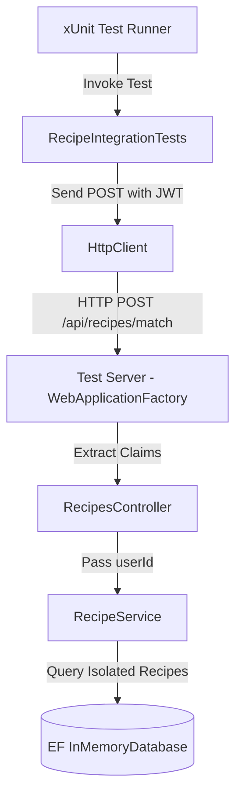

# Phase 1 Test Rollout — Critical-Path Coverage — Plan Brief

> Full plan: [plan.md](file:///c:/Users/reade/Documents/10xDev%20Project/context/changes/testing-critical-path-coverage/plan.md)
> Research: [research.md](file:///c:/Users/reade/Documents/10xDev%20Project/context/changes/testing-critical-path-coverage/research.md)

## What & Why

We are implementing critical-path tests for rollout Phase 1 of the test plan. This change ensures the security and correctness of our recipe search by verifying that user JWT tokens are parsed correctly and private recipe data is isolated (preventing leak of User B's recipes to User A), and that the match rate formula and sorting algorithm perform as expected under midpoint Banker's rounding and edge cases.

## Starting Point

The backend API utilizes classic controllers and extracts user IDs from JWT tokens, but lacks integration tests. The unit test suite is limited to service-level code using mock db contexts, which does not cover the HTTP/JWT-to-service mapping. The match rate calculation relies on Banker's rounding and primary/spice weights, with test cases that verify matching behavior but do not assert complex sorting tie-breakers or boundary conditions.

## Desired End State

A robust, automated test suite that includes:
- HTTP-level integration tests asserting that the `/match` endpoint enforces valid JWT authentication and isolates private recipes.
- Unit tests verifying Banker's rounding, spice-only recipes, 0% matches, and multi-level sorting tie-breakers.
- Zero manual verification steps needed, as the tests fully cover the requirements.

## Key Decisions Made

| Decision | Choice | Why (1 sentence) | Source |
| --- | --- | --- | --- |
| Test DB Override | Override DbContext with EF InMemoryDatabase | Simplifies database setup and runs quickly in memory without needing SQLite file connections or migration syncs. | Plan (User A1) |
| JWT Authentication Mock | Generate a real JWT token in the tests | Validates the actual claims extraction and JwtBearer middleware configurations without bypassing security wiring. | Plan (User A2) |
| Midpoint Rounding | Keep Banker's Rounding and document it | Preserves the existing rounding behavior to avoid breaking contract expectations or current database tests. | Plan (User A3) |
| Integration Test Scope | Full path tests (Successful matching, 401, data isolation) | Covers all aspects of the JWT validation and data access pipeline to prevent security regressions. | Plan (User A4) |
| Sorting Assertions | Assert sorting order with multi-level tie-breakers | Prevents sorting order regressions when multiple recipes share match rates or missing primary counts. | Plan (User A5) |

## Scope

**In scope:**
- Adding `Microsoft.AspNetCore.Mvc.Testing` package.
- Creating `RecipeIntegrationTests.cs` using `WebApplicationFactory<Program>`.
- Writing HTTP-level tests for authentication check (missing/invalid tokens) and private recipe isolation.
- Writing unit tests for Banker's rounding, all-spice recipe calculations, zero-match exclusions, and sorting tie-breakers.

**Out of scope:**
- Modifying controller or service production code (test-only change).
- Configuring physical SQLite database or migrations for testing.
- Frontend or end-to-end integration tests.

## Architecture / Approach

Integration tests will launch an in-process ASP.NET Core test server using `WebApplicationFactory<Program>`. During host construction, `AppDbContext` is intercepted and re-registered to use EF Core's `InMemoryDatabase`. Real JWT tokens are signed using the same JWT settings config and key string as Development mode, which are then passed in the `Authorization` header of the HTTP requests sent to the test server.

## Phases at a Glance

| Phase | What it delivers | Key risk |
| --- | --- | --- |
| 1. Setup Test Infrastructure | `WebApplicationFactory` bootstrap and database interceptor | Portability of internal entry point `Program` class |
| 2. JWT & Isolation Integration Tests | Integration tests for authentication and User A/B isolation | JWT secret signature mismatch in test environment |
| 3. Match Rate & Sorting Unit Tests | Coverage for Banker's rounding and multi-level sorting tie-breakers | Mirrored calculation assertions (Oracle problem) |

**Prerequisites:** Backend compiles successfully and current tests pass.  
**Estimated effort:** ~1-2 sessions across 3 phases.

## Open Risks & Assumptions

- **Assumed JWT Secret:** Assumes that the development JWT configuration secret `"SuperSecure10xCookBookSecretKey2026!ThatIsAtLeast32BytesLong"` is used when running tests.
- **Top-Level Program:** Assumes the compiler-generated `Program` class is internal but visible to `RecipeIntegrationTests` since they share the same assembly.

## Success Criteria (Summary)

- **100% Automated Verification:** All integration and unit tests pass with `dotnet test`.
- **Zero leakages:** Automated tests successfully detect if User B's private recipe is returned in User A's matched results.
- **Sorting correctness:** Tie-breaker assertions prevent any sorting changes.
